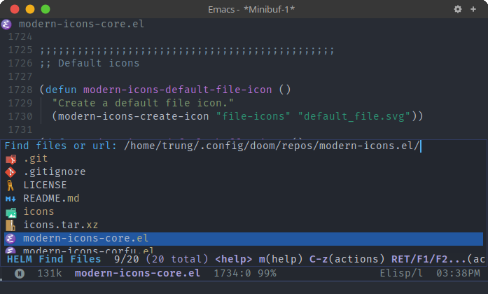
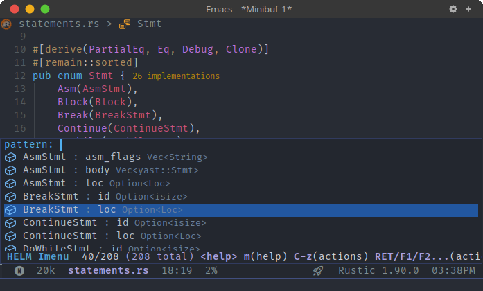
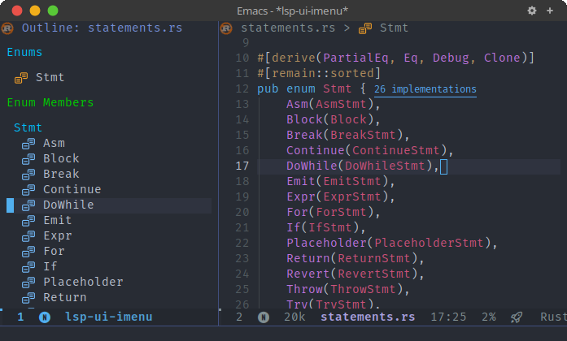
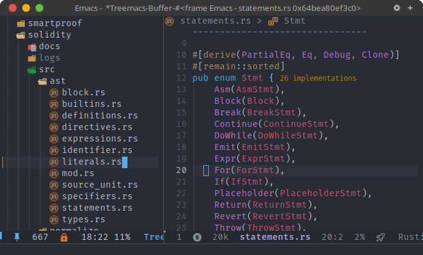

<div align="center">

# modern-icons.el

Modern and Pretty SVG icons for Emacs.

</div>

This library provides Modern and Pretty SVG icons for Emacs. It provides APIs to generate icon data for file names, directory names, buffers, major modes, code outline items.

Current packages supported by [modern-icons.el](modern-icons.el):

- [modern-icons-dired.el](modern-icons-dired.el) for [dired-mode](https://www.gnu.org/software/emacs/manual/html_node/emacs/Dired.html).
- [modern-icons-helm.el](modern-icons-helm.el) for [helm](https://github.com/emacs-helm/helm).
- [modern-icons-helm-xref.el](modern-icons-helm-xref.el) for [helm-xref](https://github.com/brotzeit/helm-xref).
- [modern-icons-lsp.el](modern-icons-lsp.el) for [lsp](https://github.com/emacs-lsp/lsp-mode).
- [modern-icons-treemacs.el](modern-icons-treemacs.el) for [treemacs](https://github.com/Alexander-Miller/treemacs).

## Installation

From Melpa (PR submitted, pending approval) or manual installation using [straight.el](https://github.com/radian-software/straight.el) like below:

  ```elisp
  (use-package modern-icons
    :straight (modern-icons :type git :host github
                            :repo "taquangtrung/modern-icons.el"))
  ```

## Usage

- To enable [modern-icons.el](modern-icons.el), include the following code into your configuration file:

  ```elisp
  (require 'modern-icons)
  (modern-icons-enable))
  ```

- To use APIs to generate icon data for files, directories, buffers, major modes, code ouline items, etc, see [modern-icons.el](modern-icons.el).

## Screenshots

- modern-icons-dired:

  <p align="center">
    
  </p>

- modern-icons-helm (helm-find-files):

  <p align="center">
    
  </p>

- modern-icons-helm (helm-imenu):

  <p align="center">
    
  </p>

- modern-icons-lsp:

  <p align="center">
    
  </p>

- modern-icons-treemacs:

  <p align="center">
    
  </p>

## Integration to new packages?

Please feel free to create a PR or discuss with us!

## Acknowledgements

This library is inspired by [all-the-icons.el](https://github.com/domtronn/all-the-icons.el), [nerd-icons.el](https://github.com/rainstormstudio/nerd-icons.el), [vscode-icon-emacs](https://github.com/jojojames/vscode-icon-emacs), [helm-icons](https://github.com/yyoncho/helm-icons/), [nerd-icons-dired](https://github.com/rainstormstudio/nerd-icons-dired), and [treemacs-nerd-icons](https://github.com/rainstormstudio/treemacs-nerd-icons).

Most of the icons in this package were obtained from VSCode [microsoft/vscode-icons](https://github.com/microsoft/vscode-icons), and its extensions [vscode-icons/vscode-icons](https://github.com/vscode-icons/vscode-icons), [vscode-material-icon-theme](https://github.com/material-extensions/vscode-material-icon-theme). Some icons were also adopted from [papirus-icon-theme](https://github.com/PapirusDevelopmentTeam/papirus-icon-theme) and [SVG Repo](https://www.svgrepo.com/).
