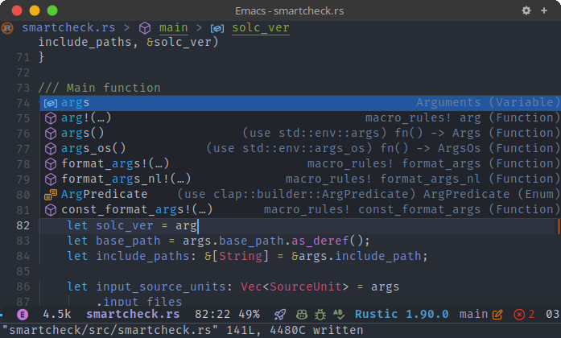

<div align="center">

# modern-icons.el

Modern and Pretty SVG icons for Emacs.

</div>

This library provides Modern and Pretty SVG icons for Emacs. It provides APIs to generate icon data for file names, directory names, buffers, major modes, code outline items.

## Installation

From Melpa (supported soon) or manual installation using [straight.el](https://github.com/radian-software/straight.el) like below:

  ```elisp
  (use-package modern-icons
    :straight (modern-icons :type git :host github
                            :repo "taquangtrung/modern-icons.el"))
  ```

## Usage

- To enable [modern-icons.el](modern-icons.el), include the following code into your configuration file:

  ```elisp
  (require 'modern-icons)
  (modern-icons-enable))
  ```

- To use APIs to generate icon data for files, directories, buffers, major modes, code ouline items, etc, see [modern-icons.el](modern-icons.el).

## Integration to existing Emacs packages.

Below are some integrations of [modern-icons.el](modern-icons.el) to existing Emacs packages:

- [modern-icons-dired.el](https://github.com/taquangtrung/modern-icons-dired.el) for [dired-mode](https://www.gnu.org/software/emacs/manual/html_node/emacs/Dired.html).
- [modern-icons-helm.el](https://github.com/taquangtrung/modern-icons-helm.el) for [helm](https://github.com/emacs-helm/helm).
- [modern-icons-helm-xref.el](https://github.com/taquangtrung/modern-icons-helm-xref.el) for [helm-xref](https://github.com/brotzeit/helm-xref).
- [modern-icons-lsp.el](https://github.com/taquangtrung/modern-icons-lsp.el) for [lsp](https://github.com/emacs-lsp/lsp-mode).
- [modern-icons-treemacs.el](https://github.com/taquangtrung/modern-icons-treemacs.el) for [treemacs](https://github.com/Alexander-Miller/treemacs).

For a full list of integrations, please see repositories in the GitHub organization: [emacs-modern-icons](https://github.com/emacs-modern-icons).

## Screenshots

- [modern-icons-corfu.el](https://github.com/emacs-modern-icons/modern-icons-corfu.el):

  <p align="center">
    
  </p>

- [modern-icons-dired.el](https://github.com/emacs-modern-icons/modern-icons-dired.el):

  <p align="center">
    
  </p>

- [modern-icons-helm.el](https://github.com/emacs-modern-icons/modern-icons-helm.el) (helm-find-files):

  <p align="center">
    
  </p>

- [modern-icons-helm.el](https://github.com/emacs-modern-icons/modern-icons-helm.el) (helm-imenu):

  <p align="center">
    
  </p>

- [modern-icons-lsp.el](https://github.com/emacs-modern-icons/modern-icons-lsp.el):

  <p align="center">
    
  </p>

- [modern-icons-treemacs.el](https://github.com/emacs-modern-icons/modern-icons-treemacs.el):

  <p align="center">
    
  </p>

## Integration to new packages?

Please feel free to create a PR or discuss with us!

## Acknowledgements

This library is inspired by [all-the-icons.el](https://github.com/domtronn/all-the-icons.el), [nerd-icons.el](https://github.com/rainstormstudio/nerd-icons.el), [vscode-icon-emacs](https://github.com/jojojames/vscode-icon-emacs).

Most of the icons in this package were obtained from VSCode [microsoft/vscode-icons](https://github.com/microsoft/vscode-icons), and its extensions [vscode-icons/vscode-icons](https://github.com/vscode-icons/vscode-icons), [vscode-material-icon-theme](https://github.com/material-extensions/vscode-material-icon-theme). Some icons were also adopted from [papirus-icon-theme](https://github.com/PapirusDevelopmentTeam/papirus-icon-theme) and [SVG Repo](https://www.svgrepo.com/).
